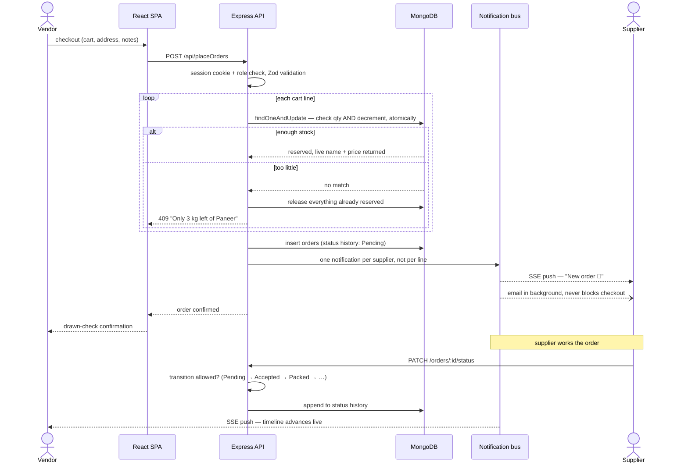

<p align="center">
  
</p>

<h1 align="center">VendorVerse</h1>

<p align="center">
  <i>Street food runs on trust, phone calls and guesswork. The supply chain behind it shouldn't.</i><br/>
  A marketplace that connects <b>Indian street food vendors</b> with <b>local raw-material suppliers</b> —
  live inventory, prices you can actually compare, atomic stock so the last crate is never sold twice,<br/>
  and an order that tells both sides exactly where it is, the moment it moves.
</p>

<p align="center">
  <a href="#-the-problem">The problem</a> ·
  <a href="#-the-core-insight">The insight</a> ·
  <a href="#-how-an-order-actually-works">How an order works</a> ·
  <a href="#%EF%B8%8F-architecture">Architecture</a> ·
  <a href="#-quick-start">Quick start</a> ·
  <a href="#-the-api">The API</a> ·
  <a href="#-why-you-can-trust-it">Trust</a>
</p>

<p align="center">
  
  
  
  
  
  
  
</p>

<p align="center">
  <sub><code>2 roles</code> · <code>8 units of sale</code> · <code>6 categories</code> · <code>7 order states</code> · <code>27 test suites</code> · <code>live SSE notifications</code> · <code>dark mode</code></sub>
</p>

---

## At a glance

- **Prices you can compare** — every listing is priced *per unit* (kg, L, piece, dozen, crate…), so "₹40" always means "₹40 per something specific". Two onion listings from two suppliers are directly comparable, which is the whole point of a marketplace.
- **The last crate is never sold twice** — stock is reserved in **one atomic MongoDB update**: the availability check and the decrement happen in a single document operation, so two vendors racing for the same crate cannot both win. There is a test that proves it.
- **A zero-trust cart** — the client says *what* it wants to buy; the item's **name and price are always read from the live listing** on the server. A tampered or stale cart cannot dictate either.
- **An order that can't lie about where it is** — a 7-state machine (`Pending → Accepted → Packed → Out for delivery → Delivered`, with `Rejected` and `Cancelled` as exits) where every transition is validated. Nothing moves backwards, and nothing leaves a terminal state.
- **Both sides hear about it live** — server-sent events push new orders to the supplier's dashboard and status changes to the vendor's, the moment they happen. Optional email alerts cover the closed-tab case — sent in the background, so a slow mail server can never fail a checkout.
- **Grounded in the real world** — live government mandi rates (Agmarknet) beside the listings they judge, a two-day forecast for the vendor's corner (Open-Meteo), nearby suppliers on an OpenStreetMap with real road travel times (OSRM), and PIN-code address autofill (India Post). All of it proxied and cached server-side — the CSP keeps the browser on `'self'`, and none of it can break the marketplace it decorates.
- **A marketplace with a memory** — purchase-verified star ratings on every supplier, a price-history chart behind every listed price, one-tap reorders re-checked against the live listing, restock alerts for vendors and low-stock warnings for suppliers, a delivery window chosen at checkout, distance to suppliers near you, and a printable invoice for every order.
- **Sessions that survive a hostile browser** — httpOnly JWT cookies (no token in localStorage to steal), Helmet with a real CSP, rate limiting on the API, and single-use one-hour password-reset links.
- **Small on purpose** — the backend is **~1,700 lines of Node**, guarded by **1,700+ lines of tests** that run against a real MongoDB spun up in memory. No mocks pretending to be a database.
- **Installable** — a PWA with dark mode and a responsive layout, because a street vendor's computer is their phone.

---

## 🧄 The Problem

> It's 5 a.m. A chaat vendor in Kanpur needs onions, oil and paneer before the lunch rush.
> Right now, **what happens next is a phone call and a guess.**

The vendor calls the supplier they've always called, asks what things cost today, and takes the answer on faith. There are **four** ways this goes wrong, and each one costs a day's margin:

| ❌ | Failure | What it looks like |
|:--:|---|---|
| **1** | **Opaque prices** | "₹40 a bag" — how big is the bag? Compared to what? |
| **2** | **Stale stock** | An hour negotiating an order for paneer the supplier ran out of yesterday |
| **3** | **No paper trail** | "You ordered five." "I ordered three." Nobody wrote anything down |
| **4** | **Silence** | The order is… somewhere. Packed? On a bike? Nobody knows until it arrives, or doesn't |

The supplier has the mirror-image problem: their inventory lives in their head, their orders arrive by phone at all hours, and they find out about a missed order when an angry vendor calls.

---

## 💡 The Core Insight

Everything in this project follows from one comparison:

<div align="center">

| | 🧅 **Supplier A** | 🧅 **Supplier B** |
|---|:---:|:---:|
| Quoted price | "₹500 a sack" | "₹35/kg" |
| Sack size | who knows | — |
| Stock right now | "call and ask" | **74 kg, live** |
| **Can you compare them?** | ❌ | ✅ |

</div>

> ### 🎯 A marketplace is only a marketplace if listings are comparable and stock is true.
> ### So every price is **per unit**, and every quantity is **live and atomically reserved**.

That second half is the hard part. "Live stock" is easy to display and easy to get wrong: the moment two vendors can check out at the same time, a naive *read stock → check → subtract* sequence sells the same crate twice. Which brings us to how an order actually works.

---

## 🔩 How an Order Actually Works

*The load-bearing decisions, in four moves.*

### ⚖️ Move 1 — Price per unit, everywhere

Units are a fixed vocabulary — `kg, g, L, ml, piece, dozen, crate, sack` — shared by the supplier's listing form, the vendor's filters and the validation schema, all reading from **one file** so they cannot drift apart. A listing without a comparable price cannot exist, because the schema won't accept one.

### ⚛️ Move 2 — Reserve stock atomically, or not at all

The naive checkout reads the stock, checks it's enough, then subtracts. Between the read and the write, another vendor's checkout does the same thing — and the last crate ships twice.

Here, the check and the decrement are **one document operation**:

```js
// The filter and the $inc happen in one atomic update — two vendors
// racing for the last crate cannot both win.
Supplier.findOneAndUpdate(
  { supplierId, inventory: { $elemMatch: { _id: itemId, quantity: { $gte: qty } } } },
  { $inc: { 'inventory.$.quantity': -qty } },
)
```

If the quantity isn't there, the update matches nothing and the checkout fails with an honest message — *"Only 3 kg left of Paneer, you asked for 5 kg"*. A multi-line cart reserves line by line, and if any line fails, **everything already reserved is released**. No half-orders, no phantom stock.

### 🚦 Move 3 — A state machine, not a status field

An order's status isn't a string anyone can set. It's a graph:

```
Pending ──► Accepted ──► Packed ──► OutForDelivery ──► Delivered
   │            │
   ├─► Rejected └─► Cancelled
```

The transition table lives on the model, every `PATCH` is checked against it, and each hop is appended to a **status history** with a timestamp — so the order detail page can draw a truthful timeline. Nothing moves backwards. `Delivered`, `Rejected` and `Cancelled` are one-way doors.

> 💊 One detail borrowed from real inventory systems: **cancelling an order puts the stock back; delivering it does not.** Resources that quietly regenerate are the easiest way for a system to flatter its own numbers.

### 📣 Move 4 — Tell people, without ever blocking them

When an order lands, the supplier should know *now*. But notifying must never take down the thing that triggered it, so the pipeline is layered:

1. **Persist** the notification (it survives a closed tab),
2. **Push** it over an in-process event bus to every dashboard that user has open, via **server-sent events**,
3. **Email** — optionally — *in the background*. Waiting on SMTP would put seconds onto a checkout response, and a slow mail server must not fail an order.

And one courtesy: a five-item cart from one supplier lands as **one** notification, not five.

---

## 🏗️ Architecture

Three pieces. A storefront, a counter, and a stockroom.

```
   YOUR BROWSER                 THE API                    THE DATA
   (the storefront)             (the counter)              (the stockroom)

   Frontend/  React 18   <───>  Backend/  Express 5  <───> MongoDB Atlas
   Vite, Tailwind, PWA          Zod validation,            Mongoose models,
   SSE listener                 JWT cookies, SSE           atomic updates
```

| 🛍️ **The Frontend** | `Frontend/` · React 18 + Vite + Tailwind |
|---|---|
| Two experiences in one SPA: the vendor's storefront (browse, compare, cart, checkout, track) and the supplier's dashboard (inventory, incoming orders, analytics). A PWA with dark mode, an SSE listener feeding the notification bell, and micro-interactions — fly-to-cart, rolling numbers, haptics — because software for daily use should feel good daily. |

| 🧾 **The API** | `Backend/` · ~1,700 lines of Express 5 |
|---|---|
| Zod-validated routes, session auth with httpOnly JWT cookies, role checks (vendor / supplier) on every endpoint, Helmet CSP, rate limiting, and the order service described above. In production it also serves the built SPA, so the whole thing deploys as **one process**. |

| 🗄️ **The Data** | MongoDB · Mongoose |
|---|---|
| Users, suppliers with embedded inventory, orders with status history, notifications. The embedding is deliberate: a supplier's inventory living *inside* the supplier document is what makes the atomic `$elemMatch` + `$inc` reservation possible in a single operation. |

### 🔄 The full order lifecycle

One checkout, all the way through — browser to API to the atomic reservation, and on through the live notifications on both sides.



Two details worth catching in that diagram. The **name and price come back from the reservation itself** — the server never trusts the cart's copy. And a failed line **rolls back every earlier reservation** before the vendor sees the error, so stock is never stranded.

---

## 🚀 Quick Start

You need exactly two things: **Node.js 18+** and a **MongoDB connection string** (a free Atlas cluster works). The test suite needs neither a running server nor Atlas — it spins up its own MongoDB in memory.

**1. Clone and install** — the backend and frontend have separate dependencies.

```bash
git clone https://github.com/Shreyansh-Kushwaha/VendorVerse.git
cd VendorVerse
cd Backend  && npm install && cd ..
cd Frontend && npm install && cd ..
```

**2. Configure the backend.** Copy `Backend/.env.example` to `Backend/.env` and fill it in.

| Variable | Required | Notes |
|---|---|---|
| `MONGO_URI` | yes | MongoDB Atlas connection string |
| `JWT_SECRET` | yes | Signs session cookies. The server refuses to start without it. |
| `CLOUDINARY_CLOUD_NAME` `_API_KEY` `_API_SECRET` | for image upload | Item photos |
| `CORS_ORIGINS` | no | Comma separated. Leave empty when Express serves the built SPA. |
| `SMTP_HOST` `SMTP_PORT` `SMTP_USER` `SMTP_PASS` | no | Email alerts. Leave `SMTP_HOST` empty to turn email off — in-app and live alerts still work. |
| `MAIL_FROM` | no | From address on alert emails |
| `APP_URL` | no | Public base URL, used for the "View order" link in emails |
| `PORT` | no | Defaults to 3000 |
| `NODE_ENV` | no | Set to `production` on deploy so cookies are marked Secure |

Generate a secret with:

```bash
node -e "console.log(require('crypto').randomBytes(32).toString('hex'))"
```

**3. Run it.**

Development — two terminals. Vite proxies `/api` to the backend.

```bash
cd Backend  && npm run dev     # http://localhost:3000
cd Frontend && npm run dev     # http://localhost:5173
```

Production — build the SPA first, then the backend serves it from one process.

```bash
cd Frontend && npm run build
cd Backend  && npm start       # http://localhost:3000
```

### 🎛️ Every command

| Command | Where | What it does |
|---|---|---|
| `npm run dev` | `Backend/` | API with auto-restart on change |
| `npm test` | `Backend/` | **171 integration tests** against an in-memory MongoDB, no Atlas needed |
| `npm start` | `Backend/` | Production server, serves the built SPA too |
| `npm run dev` | `Frontend/` | Vite dev server with `/api` proxy |
| `npm run build` | `Frontend/` | Production bundle into `dist/` |
| `npm run lint` | `Frontend/` | ESLint, including the react-hooks rules |

All of it runs on every push and pull request via GitHub Actions.

---

## 📡 The API

All routes live under `/api`. Everything except registration, login and public supplier profiles requires a session cookie.

| Method | Route | Who |
|---|---|---|
| `POST` | `/register` `/login` `/logout` | anyone |
| `POST` | `/forgot-password` `/reset-password` | anyone, rate limited |
| `GET` | `/me` | signed in |
| `PATCH` `DELETE` | `/users/:id` | that user only |
| `GET` | `/suppliers` | anyone — searchable, paginated directory |
| `GET` | `/suppliers/:id` `/suppliers/:id/inventory` | anyone |
| `POST` | `/suppliers` | supplier |
| `PATCH` `DELETE` | `/suppliers/:id/inventory/:itemId` | that supplier only |
| `POST` | `/placeOrder` `/placeOrders` | vendor |
| `GET` | `/vendor/orders` `/vendor/analytics` `/vendor/insights` | vendor |
| `GET` | `/orders` `/supplier/analytics` | supplier |
| `PATCH` | `/orders/:id/status` | that order's supplier |
| `GET` | `/orders/:id` | that order's buyer or seller |
| `POST` | `/upload` | signed in |
| `GET` | `/notifications` | signed in |
| `POST` | `/notifications/:id/read` `/notifications/read-all` | that recipient only |
| `GET` | `/notifications/stream` | signed in, server-sent events |
| `GET` | `/mandi` `/weather` `/route-matrix` | signed in, proxied + cached external data |
| `GET` | `/pincode/:pin` | anyone — powers the signup autofill |
| `GET` | `/health` | anyone |

> 🔒 The rule underneath the table: **ownership is checked on every mutating route.** A supplier can only touch their own inventory and their own orders' statuses; a vendor can only read their own orders; a notification can only be marked read by its recipient. And item name and price are always read from the live listing — the client cannot set either.

---

## ✅ Why You Can Trust It

**171 assertions across 27 suites**, run against a **real MongoDB spun up in memory** — not mocks pretending to be a database. The suite exits non-zero on failure and runs on every push.

```
cd Backend && npm test        171 tests, 27 suites, no Atlas connection needed
```

<details open>
<summary><b>What the tests actually pin down</b></summary>

<br>

- ⚛️ **Concurrency at the shelf** — parallel checkouts racing for limited stock end with exactly the right number of successes and the stock at exactly zero, never negative.
- 🚦 **Every illegal transition refuses** — orders cannot move backwards, cannot leave `Delivered`/`Rejected`/`Cancelled`, and only the order's own supplier can move them at all.
- 🔐 **Authorization per endpoint** — each route is probed as the wrong role and the wrong owner, and each one refuses on its own.
- 💰 **The cart cannot lie** — a request carrying its own price or item name has both overwritten by the live listing's values.
- 📴 **Cancel restores stock; deliver does not** — the asymmetry that keeps the inventory honest.
- 📨 **Notification delivery over a real SSE connection**, and the email channel against a stub transport — including that a failing mail server does not fail the checkout.
- 🔑 **Password reset links are single-use and expire** — a used or stale token is refused.
- ⚖️ **Units survive the round trip** — the unit a supplier lists in is the unit on the order, the notification and the analytics.
- 🛡️ Security headers, health checks, index presence, and Zod validation edges.

</details>

---

## 🔍 Honest Limitations

*Stated plainly, because a README that only reports good news is marketing.*

| Limitation | Detail |
|---|---|
| 📡 **One instance, one bus** | Live notifications fan out over an in-process `EventEmitter`. Perfect on a single Render instance; the moment this scales to two, that bus needs a shared broker (Redis pub/sub). The code says so in a comment at the exact spot. |
| 💳 **No payments** | Orders are commitments, not transactions. UPI is the obvious next step and is on the roadmap. |
| 📍 **No geography** | "Local" is on the honour system — there's no distance filter matching vendors to suppliers who actually deliver to their area. |
| ⭐ **No reputation** | No ratings or reviews yet, so trust between strangers still forms off-platform. |
| 🖼️ **Images depend on Cloudinary** | Without the three Cloudinary keys, listings fall back to category-tinted placeholders — functional, but a photo sells onions better than a tint does. |

---

## 📢 Roadmap

- ⭐ Supplier ratings and reviews
- 📍 Match vendors to suppliers who deliver to their area
- 💳 Online payment via UPI

---

<div align="center">

### 🧅 The one thing to look at

**Two vendors. One crate of paneer left. Both hit "Place order" in the same second.**

One gets a confirmation. The other gets *"Only 0 kg left of Paneer"* — instantly, honestly, before any money or trust changed hands. The stock never goes negative, and no supplier ever has to make the apologetic phone call.

*That single race contains the entire argument for why a marketplace's inventory must be atomic, not eventually-sort-of-right.*

<br>

**If you like this project — star it, fork it, use it in your own.**

</div>
